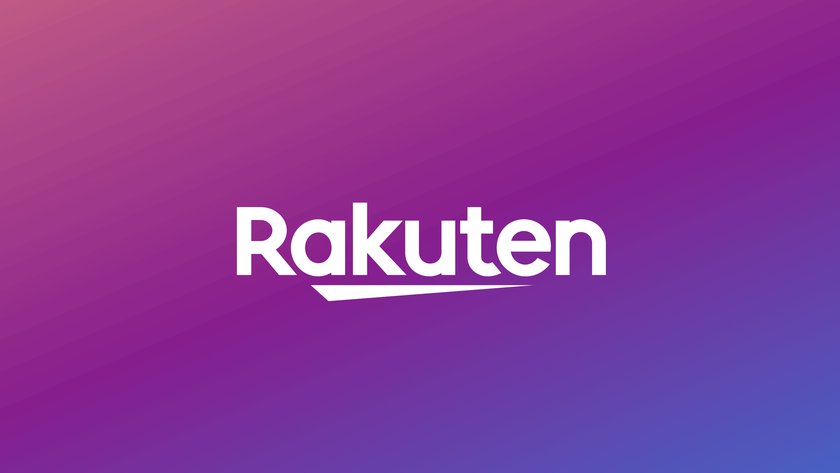
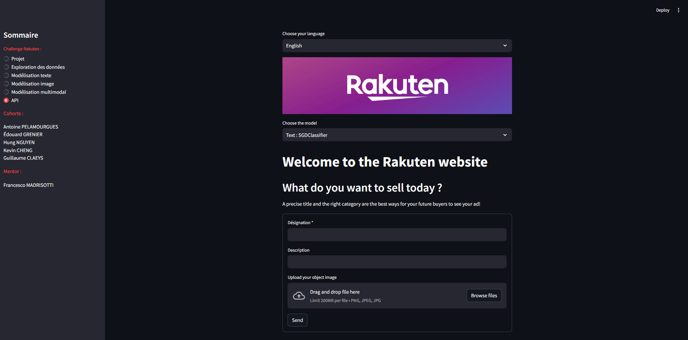
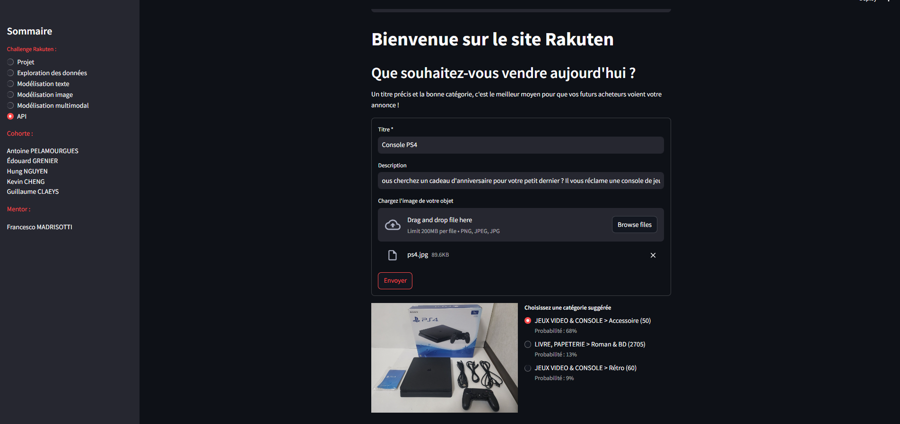

<h1>Challenge Rakuten France Multimodal Product Data Classification</h1>

<h2>:diamond_shape_with_a_dot_inside:Contexte</h2>

Ce challenge porte sur le thème de la classification multimodale (texte et image) des codes types de produits à grande échelle où l'objectif est de prédire le code type de chaque produit tel que défini dans le catalogue de Rakuten France.

Le catalogage des listes de produits via la catégorisation des titres et des images est un problème fondamental pour tout marché de commerce électronique, avec des applications allant de la recherche personnalisée et des recommandations à la compréhension des requêtes.

Les approches de catégorisation manuelles et basées sur des règles ne sont pas évolutives puisque les produits commerciaux sont organisés en plusieurs classes. Le déploiement d'approches multimodales serait une technique utile pour les entreprises de commerce électronique, car elles ont du mal à catégoriser les produits en fonction des images et des étiquettes des commerçants et à éviter les duplications, en particulier lorsqu'elles vendent à la fois des produits neufs et d'occasion auprès de commerçants professionnels et non professionnels, comme le fait Rakuten.

Les progrès dans ce domaine de recherche ont été limités en raison du manque de données réelles provenant de catalogues commerciaux réels. Le défi présente plusieurs aspects de recherche intéressants en raison de la nature intrinsèquement bruyante des étiquettes et des images des produits, de la taille des catalogues de commerce électronique modernes et de la distribution déséquilibrée typique des données.

<h2>:diamond_shape_with_a_dot_inside:Objectif</h2>

L'objectif de ce défi de données est la classification multimodale à grande échelle (texte et image) des données de produits en codes de types de produits. Par exemple, dans le catalogue Rakuten France, un produit avec une désignation ou un titre français « Klarstein Présentoir 2 Montres Optique Fibre » associé à une image et parfois à une description complémentaire. Ce produit est classé sous le code de type de produit 1500. Il existe d'autres produits avec des titres, des images et des descriptions possibles différents, qui se trouvent sous le même code de type de produit. Compte tenu de ces informations sur les produits, comme l'exemple ci-dessus, ce défi propose de modéliser un classificateur pour classer les produits dans son code type de produit correspondant.

<h2>:diamond_shape_with_a_dot_inside:Data description</h2>

Pour ce challenge, Rakuten France propose environ 99 000 listes de produits au format CSV, y compris le train (84 916) et l'ensemble de test (13 812). L'ensemble de données comprend les désignations de produits, les descriptions de produits, les images de produits et leur code de type de produit correspondant. Les données sont réparties selon deux critères, formant quatre ensembles distincts : formation ou test, entrée ou sortie.

<ul type="disc">
  <li>X_train.csv : fichier d'entrée de formation</li>
  <li>Y_train.csv : fichier de sortie de formation</li>
  <li>X_test.csv : fichier d'entrée de test </li>
</ul>

De plus, le fichier images.zip est fourni contenant toutes les images. La décompression de ce fichier fournira un dossier nommé images avec deux sous-dossiers nommés image_training et image_test, contenant respectivement des images de formation et de test. 

<h2>:diamond_shape_with_a_dot_inside:Resultats obtenus concernant le texte</h2>

<h3>Vectorisation par sac de mots</h3>

| Model          | Train Accuracy ± StdDev | Validation Accuracy ± StdDev | Train Weighted F1 Score ± StdDev | Validation Weighted F1 Score ± StdDev | Time                |
| ------------- | ---------------------- | ---------------------------- | ---------------------------------- | ------------------------------------ | ------------------- |
| K-Neighbors   | 69.5%                  | 59.5%                        | 71.2%                             | 61.3%                                | 5 seconds           |
| Logistic Regr.| 70.0%                  | 67.7%                        | 71.2%                             | 61.3%                                | 5 seconds           |
| Random Forest  | 71.1%                  | 70.9%                        | 71.7%                             | 71.5%                                | 4 ms                |
| XGBoost       | 82.9%                  | 72.9%                        | 83.7%                             | 73.7%                                | 1.5 minutes        |
| Neural Netw.  | 80.3%                  | 75.6%                        | 80.4%                             | 75.5%                                | 3 minutes           |
| Linear SVC    | 71.7%                  | 70.0%                        | 71.3%                             | 69.6%                                | 1 second            |
| Naive Bayes   | 67.8%                  | 66.0%                        | 65.2%                             | 63.3%                                | 0.1 seconds         |

<h3>Vectorisation par plongement lexical</h3>

| Model         | Accuracy | Top 3 Accuracy | Weight F1 |
| ------------- | -------- | -------------- | --------- |
| SVC           | 65%      | 84%            | 63%       |
| Logistic Regr.| 62%      | 81%            | 61%       |
| Neural Netw.  | 65%      | 84%            | 64%       |

<h3>LLM</h3>

| Metric        | eval\_loss | eval\_accuracy  | eval\_f1    | eval\_precision   |
| ------------- | ---------- | --------------- | ----------- | ----------------- |
| train         | 0.33       | 90.3%           | 88%         | 90%               |
| val           | 0.74       | 79.1%           | 76.9%       | 79.5%             |
| test          | 0.75       | 78.7%           | 75.9%       | 78.4%             |

<h2>:diamond_shape_with_a_dot_inside:Resultats obtenus concernant les images</h2>

| Model            | Accuracy | F1Score Weighted | Delay (ms/step) |
| ---------------- | -------- | --------------- | --------------- |
| VGG16            | 63.8%    | 63.2%           | 10              |
| EfficientNet B1   | 53.1%    | 53.7%           | 9               |
| EfficientNet V2   | 62%      | 61%             | 46              |

<h2>:diamond_shape_with_a_dot_inside:Resultats obtenus par fusion texte et image</h2>

| Model                                  | Merge Type | Text Score | Image Score | Fusion Score |
| ------------------------------------- | ---------- | ---------- | ----------- | ------------ |
| Bert + LSTM + InceptionV3               | Early      | 0.742      | 0.628       | 0.83         |
| LSTM + EfficientNetB4                   | Early      | 0.813      | 0.606       | 0.52\*       |
| Bert + EfficientNetV2L                  | Score level | 0.848      | 0.67        | 0.8704        |

<h2>:diamond_shape_with_a_dot_inside:Création d'une API</h2>

Nous avons créé une API utilisant pour frontend Streamlit et pour backend Fastapi. Nous souhaitions ainsi finaliser le projet en ayant une interface proche de celle des sites de vente en ligne. L'utilisateur choisit sa langue, le modèle qu'il souhaite utiliser puis va saisir le titre et la description de l'objet qu'il souhaite vendre. Il doit ensuite uploader la photographie de l'objet mis en vente. En retour, il reçoit les 3 classes les plus probables correspondantes à son objet :

<h2>:diamond_shape_with_a_dot_inside:Déploiement de l'application</h2>

Suivez ces étapes pour démarrer localement l'application composée des parties frontend et backend :

<ul type="disc">
  <li>Étape 1 : Obtenir les images Docker</li>  
    
Ouvrez un terminal et vérifiez que vous disposez d'installation valide de Docker. Si ce n'est pas encore fait, suivez les instructions officielles fournies par Docker : <https://docs.docker.com/get-docker/> 

    
Téléchargez les images Docker à partir du référentiel public Docker Hub :

    
docker pull antoinepela/projet_rakuten:backend_rakuten_v1.0docker pull antoinepela/backend_rakuten

    
docker pull antoinepela/projet_rakuten:frontend_rakuten_v1.0

   
      
  <li>Étape 2 : Cloner le dépôt</li>
    
Au sein de ce dépôt GitHub, télécharger le fichier docker-compose.yaml situé dans le dossier /app, fichier à placer au sein du dossier contenant les dossiers frontend et backend.

    
  <li>Étape 3 : Lancement de l'application</li>
    
Accédez au dossier du dépôt cloné dans le terminal et lancez les applications frontend et backend avec Docker Compose :

    
cd <NOM_DU_DOSSIER_CLONE>

    
docker-compose up --build

    
Remplacez <NOM_DU_DOSSIER_CLONE> par le nom du dossier dans lequel vous avez cloné le dépôt. Attendez jusqu'à ce que l'ensemble des services soit démarré avec succès.

    
L'application devrait maintenant être accessible.

  
</ul>

