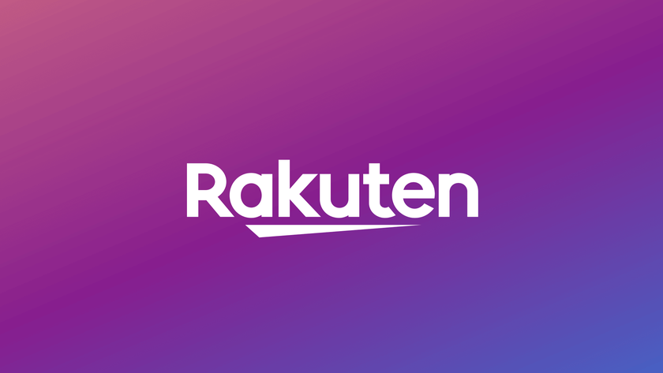
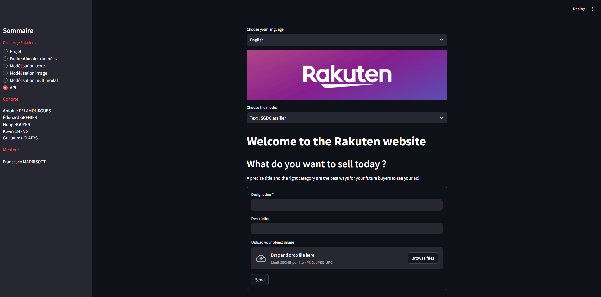
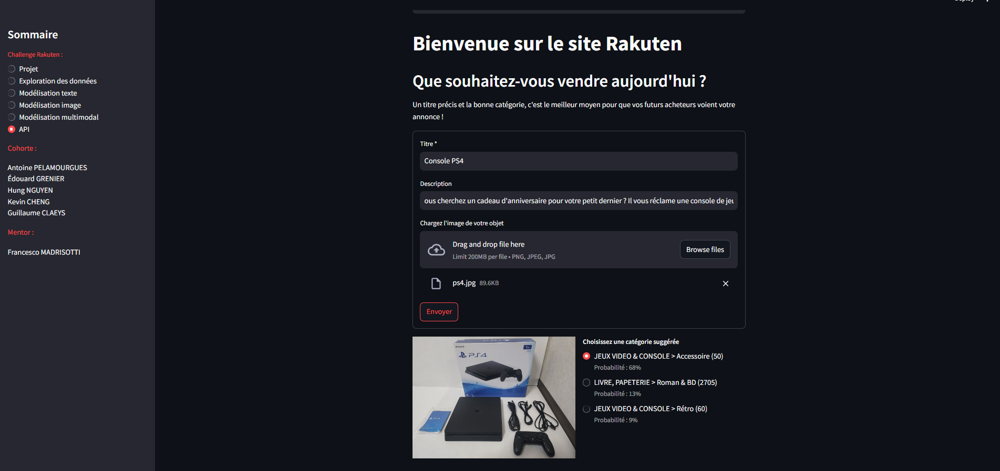

<h1>Challenge Rakuten France Multimodal Product Data Classification</h1>



<h2>:diamond_shape_with_a_dot_inside:Présentation vidéo du projet (25 minutes)</h2>

Cliquez sur l'image ci-dessous pour regarder la vidéo :

[](https://youtu.be/yrr4jtXSoes)

<h2>:diamond_shape_with_a_dot_inside:Contexte</h2>

<p>Le challenge Rakuten France Multimodal Product Data Classification s'inscrit dans un enjeu majeur pour les plateformes de commerce en ligne : l'automatisation du catalogage des produits. La classification précise des produits à partir de leurs descriptions textuelles et de leurs images est essentielle pour améliorer la recherche personnalisée, les recommandations et la compréhension des requêtes utilisateurs.

Ce défi propose d'explorer des approches multimodales de classification, en exploitant à la fois les informations textuelles (titres, descriptions) et visuelles (images) des produits. L'objectif est de dépasser les limites des méthodes manuelles ou basées sur des règles, qui ne sont pas adaptées à la taille et à la complexité des catalogues de commerce électronique modernes.

Un aspect particulièrement intéressant de ce challenge est la prise en compte de la nature intrinsèquement bruitée des données (labels et images), ainsi que de la distribution déséquilibrée des classes. Ces contraintes, typiques des données réelles, rendent la tâche de classification particulièrement difficile et motivent l'exploration de techniques robustes et performantes.

Dans le cadre de ce projet, nous avons mis l'accent sur la mise en place d'une chaîne MLOps, depuis l'entraînement des modèles jusqu'à leur déploiement en production via une application web. Notre objectif est de proposer une solution non seulement performante, mais aussi facile à déployer, à monitorer et à maintenir dans un contexte réel.</p>

<h2>:diamond_shape_with_a_dot_inside:Objectif</h2>

<p>L'objectif principal de ce challenge est de développer un modèle de classification multimodale à grande échelle capable de prédire les codes types des produits du catalogue Rakuten France. Chaque produit est décrit par plusieurs modalités : un titre (ex. "Klarstein Présentoir 2 Montres Optique Fibre"), une image, et parfois une description complémentaire. Ces informations doivent être exploitées conjointement pour associer chaque produit à son code type correspondant (par exemple, le code 1500).

Ce défi vise à surmonter les limitations des approches manuelles ou basées sur des règles, qui ne sont pas adaptées à la complexité et à la taille des catalogues modernes. En s'appuyant sur des techniques avancées de deep learning et de fusion multimodale, le modèle doit être capable de gérer les données bruitées (titres imprécis, images de qualité variable) et la distribution déséquilibrée des classes, tout en offrant une solution scalable pour le commerce électronique.

La performance des modèles sera évaluée à l'aide du score F1 pondéré, un indicateur clé pour mesurer leur capacité à classer correctement les produits dans un environnement réaliste.</p>

<h2>:diamond_shape_with_a_dot_inside:Data description</h2>

<p>Pour ce challenge, Rakuten France propose environ 99 000 listes de produits au format CSV, y compris le train (84 916) et l'ensemble de test (13 812). L'ensemble de données comprend les désignations de produits, les descriptions de produits, les images de produits et leur code de type de produit correspondant. Les données sont réparties selon deux critères, formant quatre ensembles distincts : formation ou test, entrée ou sortie.</p>

<ul type="disc">
  <li>X_train.csv : fichier d'entrée de formation</li>
  <li>Y_train.csv : fichier de sortie de formation</li>
  <li>X_test.csv : fichier d'entrée de test </li>
</ul>

<p>De plus, le fichier images.zip est fourni contenant toutes les images. La décompression de ce fichier fournira un dossier nommé images avec deux sous-dossiers nommés image_training et image_test, contenant respectivement des images de formation et de test. </p>

<h2>:diamond_shape_with_a_dot_inside:Resultats obtenus concernant le texte</h2>

<h3>Vectorisation par sac de mots</h3>

| Model          | Train Accuracy ± StdDev | Validation Accuracy ± StdDev | Train Weighted F1 Score ± StdDev | Validation Weighted F1 Score ± StdDev | Time                |
| ------------- | ---------------------- | ---------------------------- | ---------------------------------- | ------------------------------------ | ------------------- |
| K-Neighbors   | 69.5%                  | 59.5%                        | 71.2%                             | 61.3%                                | 5 seconds           |
| Logistic Regr.| 70.0%                  | 67.7%                        | 71.2%                             | 61.3%                                | 5 seconds           |
| Random Forest  | 71.1%                  | 70.9%                        | 71.7%                             | 71.5%                                | 4 ms                |
| XGBoost       | 82.9%                  | 72.9%                        | 83.7%                             | 73.7%                                | 1.5 minutes        |
| Neural Netw.  | 80.3%                  | 75.6%                        | 80.4%                             | 75.5%                                | 3 minutes           |
| Linear SVC    | 71.7%                  | 70.0%                        | 71.3%                             | 69.6%                                | 1 second            |
| Naive Bayes   | 67.8%                  | 66.0%                        | 65.2%                             | 63.3%                                | 0.1 seconds         |

<h3>Vectorisation par plongement lexical</h3>

| Model         | Accuracy | Top 3 Accuracy | Weight F1 |
| ------------- | -------- | -------------- | --------- |
| SVC           | 65%      | 84%            | 63%       |
| Logistic Regr.| 62%      | 81%            | 61%       |
| Neural Netw.  | 65%      | 84%            | 64%       |

<h3>LLM</h3>

| Metric        | eval\_loss | eval\_accuracy  | eval\_f1    | eval\_precision   |
| ------------- | ---------- | --------------- | ----------- | ----------------- |
| train         | 0.33       | 90.3%           | 88%         | 90%               |
| val           | 0.74       | 79.1%           | 76.9%       | 79.5%             |
| test          | 0.75       | 78.7%           | 75.9%       | 78.4%             |

<h2>:diamond_shape_with_a_dot_inside:Resultats obtenus concernant les images</h2>

| Model            | Accuracy | F1Score Weighted | Delay (ms/step) |
| ---------------- | -------- | --------------- | --------------- |
| VGG16            | 63.8%    | 63.2%           | 10              |
| EfficientNet B1   | 53.1%    | 53.7%           | 9               |
| EfficientNet V2   | 62%      | 61%             | 46              |

<h2>:diamond_shape_with_a_dot_inside:Resultats obtenus par fusion texte et image</h2>

| Model                                  | Merge Type | Text Score | Image Score | Fusion Score |
| ------------------------------------- | ---------- | ---------- | ----------- | ------------ |
| Bert + LSTM + InceptionV3               | Early      | 0.742      | 0.628       | 0.83         |
| LSTM + EfficientNetB4                   | Early      | 0.813      | 0.606       | 0.52\*       |
| Bert + EfficientNetV2L                  | Score level | 0.848      | 0.67        | 0.8704        |

<h2>:diamond_shape_with_a_dot_inside:Création d'une application web</h2>

<p>
    Nous avons développé une application web combinant <strong>Streamlit</strong> et <strong>FastAPI</strong>. L'objectif était de créer une interface utilisateur intuitive, inspirée des sites de vente en ligne, pour enrichir l'expérience utilisateur et finaliser notre projet. L'application permet à l'utilisateur de :
</p>
<ul>
    <li>Choisir sa langue.</li>
    <li>Sélectionner le modèle qu'il souhaite utiliser.</li>
    <li>Saisir le titre et la description de l'objet qu'il souhaite vendre.</li>
    <li>Télécharger une photographie de l'objet.</li>
</ul>
<p>
    En retour, l'utilisateur reçoit les trois classes les plus probables correspondant à son objet. Cette architecture repose sur FastAPI, qui gère les requêtes et les traitements en arrière-plan, tandis que Streamlit fournit une interface utilisateur réactive et conviviale. Ensemble, ces technologies permettent une expérience fluide et moderne, idéale pour ce type d'application.
</p>






<h2>:diamond_shape_with_a_dot_inside:Guide de démarrage rapide</h2>

Vous souhaitez vendre un objet ? Nous vous aiderons à choisir sa classe ! 

Suivez ces étapes simples pour lancer rapidement l'application en local.

##  🛠️ Prérequis

Assurez-vous d'avoir installé les éléments suivants sur votre machine :

1. [Python](https://www.python.org/) >= 3.9
2. [Docker Desktop](https://docs.docker.com/desktop/)

## :computer: Installation

### Clonage du repository

Clonnez ce repository sur votre machine locale :

```bash
git clone https://github.com/dongnold/dst-sept23-rakuten.git
```

## :wrench: Configuration de Git LFS

Notre repository contient des modèles Machine Learning volumineux gérés par Git LFS. Après avoir cloné le repository, assurez-vous d'être connecté à Git LFS pour pouvoir télécharger les modèles.

### Instructions :

1. Naviguez jusqu'à la racine du répertoire cloné :

```bash
cd {REPOSITORY}
```

2. Connectez-vous à Git LFS :

```bash
git lfs login
```

  Entrez vos identifiants GitHub lorsque demandé.

3. Téléchargez les modèles Machine Learning :

```bash
git lfs pull
```

4. Construction des images Docker
   
Naviguez jusqu'à la racine du répertoire cloné et construisez les images Docker nécessaires pour l'application Backend et Frontend :

```bash
cd {REPOSITORY}
docker-compose up --build
```

Ouvrez ensuite un navigateur Web et visitez http://localhost:8000 pour afficher l'interface Streamlit.

De plus, vous pouvez envoyer des requêtes HTTP vers notre API FastAPI en visitant http://localhost:8001. Consultez la documentation OpenAPI Swagger UI pour connaître les points de terminaison disponibles.

## :skull: Arrêt de l'application

Appuyez sur Ctrl+C dans le terminal pour arrêter l'application. Confirmez l'opération si nécessaire.


